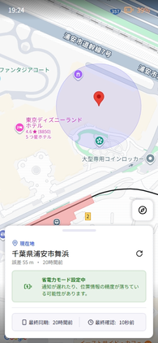
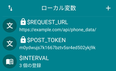

# Location Tracker

位置情報共有・リアルタイム追跡アプリ



## 概要

**Location Tracker** は、リアルタイムで特定のユーザの位置情報を共有・追跡するためのWebアプリケーションです。ユーザが5分ごとに位置情報をサーバに送信することで、どこからでも居場所をGoogle Maps APIを活用し、デバイスの現在地を地図上に可視化します。

端末の位置情報に加え、端末のバッテリー残量、マナーモードの有無、省電力モードの有無の状態も閲覧できます。

## 技術スタック

本プロジェクトで使用している主な技術は以下の通りです。

| カテゴリ       | 技術                                       |
| -------------- | ------------------------------------------ |
| **Backend**    | PHP 8+, Composer                           |
| **Frontend**   | TypeScript, SCSS                           |
| **Build Tool** | Vite                                       |
| **Service**    | Google Maps Platform (Maps JavaScript API) |

## 環境構築手順

### 前提条件

- Node.js (> v22.15 推奨)
- npm (> v11.6 推奨)
- PHP (> v8.3)
- Composer (> v2.9 推奨)

### インストール

1. **リポジトリのクローン**

   ```bash
   git clone https://github.com/vrcalphabet/location-tracker.git
   cd location-tracker
   ```

2. **PHP依存関係のインストール**

   ```bash
   composer install
   ```

3. **Node.js依存関係のインストール**

   ```bash
   npm install
   ```

4. **環境変数の設定**
   `.env.template` をコピーして `.env` を作成し、トークンの設定を行ってください。
   ```bash
   cp .env.template .env
   ```

### 環境変数の項目

- `GET_TOKEN`
  端末データ取得用、リバースジオコーディング取得用、メインページ(`/view/`)のアクセス用に使用するトークンです。任意の文字種で32桁以上のランダムな文字列を生成し、それをSHA256でハッシュ化したものを指定します。

- `POST_TOKEN`
  端末データ更新用に使用するトークンです。任意の文字種で32桁以上のランダムな文字列を生成し、それをSHA256でハッシュ化したものを指定します。

- `YAHOO_APPID`
  Yahoo!の[リバースジオコーダAPI](https://developer.yahoo.co.jp/webapi/map/openlocalplatform/v1/reversegeocoder.html)を使用してリバースジオコーディングするためのAPIキーです。

- `GOOGLE_API_KEY`
  Googleの[Google Maps JavaScript API](https://developers.google.com/maps/documentation/javascript/overview)でページに地図を埋め込みするために使用するAPIキーです。

## 使い方（サーバ側）

### 開発時

Vite のサーバーと PHP のサーバーを両方起動する必要があります。

1. **Vite サーバー起動** (アセットのホットリロード用)

   ```bash
   npm run dev
   ```

2. **PHP サーバー起動** (別途ターミナルで実行)
   ```bash
   php -S localhost:8000 -t public_html
   ```

ブラウザで `http://localhost:8000/view/` にアクセスすれば画面が表示されるはずです。

### 本番ビルド時

1. **ビルド**

   ```bash
   npm run build
   ```

   ビルドされたファイルは `public_html/assets` に出力されます。`app/`, `public_html/`, `.env`を本番環境にアップロードして PHP 依存関係のインストールを行ってください。

## 使い方（位置情報送信側）

1. **マクロのダウンロード**
   [最新のリリース](https://github.com/vrcalphabet/location-tracker/releases/latest)から`location_tracker.macro`をダウンロードして、Macrodroidで開いてください。

1. **環境変数の設定**
   マクロ画面からローカル変数を開いて、`$REQUEST_URL`に端末データ更新用URL、`$POST_TOKEN`にハッシュ化前のトークンを指定します。

   

    端末の位置情報をONにしておけば、5分毎に自動的に端末データが送信されます。なお、データ送信間隔は`$INTERVAL`から変えられます。

## ディレクトリ構成

```
location-tracker/
├── app/             # PHPアプリケーションロジック
├── public_html/     # 公開ディレクトリ (Webルート)
│   ├── api/         # APIエンドポイント
│   ├── view/        # メインビュー
│   └── assets/      # ビルド済みアセット (Vite出力先)
├── src/             # フロントエンドソースコード (TS, SCSS)
├── vendor/          # PHP依存ライブラリ
├── node_modules/    # Node.js依存ライブラリ
└── package.json     # Node.jsのパッケージ概要
```

## エンドポイント一覧

### GET `/view/`

メインページを表示します。

**パラメータ:**

| 名前    | 型     | 必須 | 説明                            |
| ------- | ------ | ---- | ------------------------------- |
| `token` | string | ✅   | ハッシュ化前の `GET_TOKEN` の値 |

---

### GET `/api/address/`

指定された座標のリバースジオコーディングを行い、住所を取得します。

**パラメータ:**

| 名前    | 型      | 必須 | 説明                            |
| ------- | ------- | ---- | ------------------------------- |
| `token` | string  | ✅   | ハッシュ化前の `GET_TOKEN` の値 |
| `lat`   | numeric | ✅   | 緯度 (-90 ~ 90)                 |
| `lon`   | numeric | ✅   | 経度 (-180 ~ 180)               |

**レスポンス例:**

```json
{
  "success": true,
  "data": {
    "address": "東京都千代田区千代田1-1"
  }
}
```

---

### GET `/api/phone_data/`

保存されている最新の端末データを取得します。

**パラメータ:**

| 名前    | 型     | 必須 | 説明                            |
| ------- | ------ | ---- | ------------------------------- |
| `token` | string | ✅   | ハッシュ化前の `GET_TOKEN` の値 |

**レスポンス例:**

```json
{
  "success": true,
  "data": {
    "timestamp": 1700000000,
    "silent_mode": true,
    "battery": 85,
    "battery_saver_mode": false,
    "location": {
      "lat": 35.681236,
      "lon": 139.767125,
      "uncertainty": 10.5
    }
  }
}
```

---

### POST `/api/phone_data/`

端末データを更新します。Macrodroidから送信します。

**パラメータ:**

| 名前                    | 型      | 必須 | 説明                            |
| ----------------------- | ------- | ---- | ------------------------------- |
| `token`                 | string  | ✅   | ハッシュ化前の `GET_TOKEN` の値 |
| `timestamp`             | integer | ✅   | Unixタイムスタンプ (秒)         |
| `silent_mode`           | boolean | ✅   | マナーモードかどうか (0, 1)     |
| `battery`               | integer | ✅   | バッテリー残量 (0 ~ 100)        |
| `battery_saver_mode`    | boolean | ✅   | 省電力モードかどうか (0, 1)     |
| `location[lat]`         | numeric | ✅   | 緯度 (-90 ~ 90)                 |
| `location[lon]`         | numeric | ✅   | 経度 (-180 ~ 180)               |
| `location[uncertainty]` | numeric | ✅   | 位置情報の誤差 (メートル)       |

**レスポンス例:**

```json
{
  "success": true
}
```
